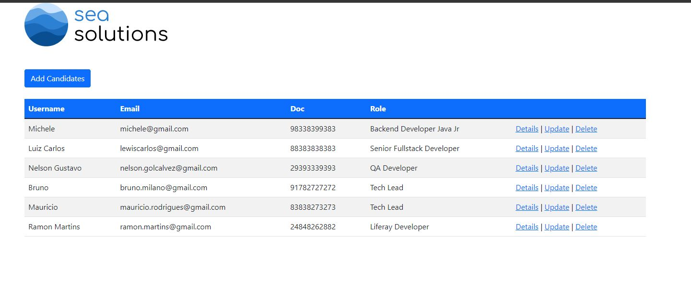
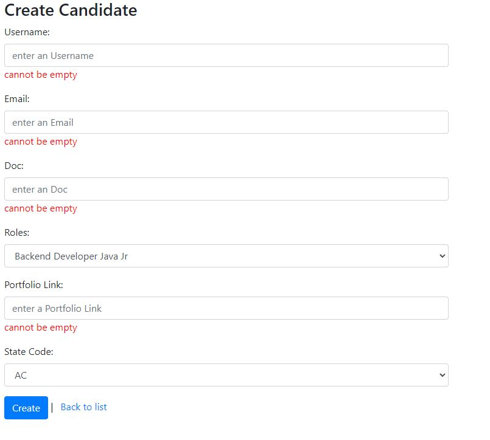
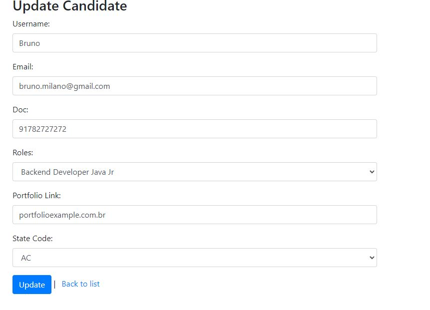
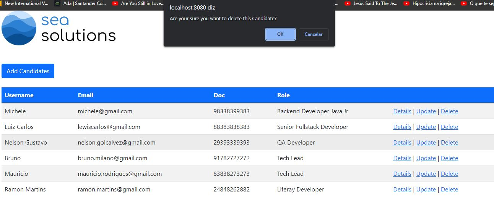
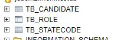

<h1>## 🖼 Cadastro de Candidatos para Vaga na Area de TI</h1>  

 
<h3>Description English</h3>

This candidate registration project for a job interview is a perfect opportunity to demonstrate your skills. With the validation of each user input and the implementation of various tests to ensure the proper functioning of the application, you will be sure that you are delivering a quality product. Furthermore, the fact that all tests passed by CI/CD and the deployment was successfully performed on Heroku is concrete proof of the excellence of their work. Don't miss the chance to stand out in a highly competitive field like IT and show potential employers that you have what it takes to create high-performance solutions in short periods of time. Invest in yourself and your career and join this project today!!

<h3>Descrição Português</h3>

Este projeto de cadastramento de candidatos para uma entrevista de emprego é uma oportunidade perfeita para demonstrar suas habilidades. Com a validação de cada input do usuário e a implementação de vários testes para garantir o bom funcionamento da aplicação, você terá a certeza de que está entregando um produto de qualidade. Além disso, o fato de que todos os testes foram aprovados pelo CI/CD e o deploy foi realizado com sucesso no Heroku, é uma prova concreta da excelência do seu trabalho. Não perca a chance de se destacar em uma área altamente competitiva como a de TI e mostre aos empregadores em potencial que você tem o que é preciso para criar soluções de alto desempenho em curtos períodos de tempo. Invista em si mesmo e em sua carreira e participe deste projeto hoje mesmo!

 
<h3>Application Images</h3>
 

whole Application

Dashboard

Create Screen Validation

Update Screen

Delete Modal

Database

 
 
## 🚀 Tech Usada 
 
- Spring Boot 
- Gradle  
- HTML and CSS with Jsp 
- Clean Code 
-   Bootstrap 
-   Unit testing, mocking and Integration Tests
-   H2 DATABASE  
-   Docker  
-    JUnit, Mockito, MockMvc  
-    CI/CD Github Actions  
-    Heroku Deploy  

 

## Linkedin Below - Linkedin ABaixo

<h4 align="center">
   Created by   <a href="https://www.linkedin.com/in/luiz-carlos-b50693173/" target="_blank"> Luiz Carlos </a>
</h4>
</html>
